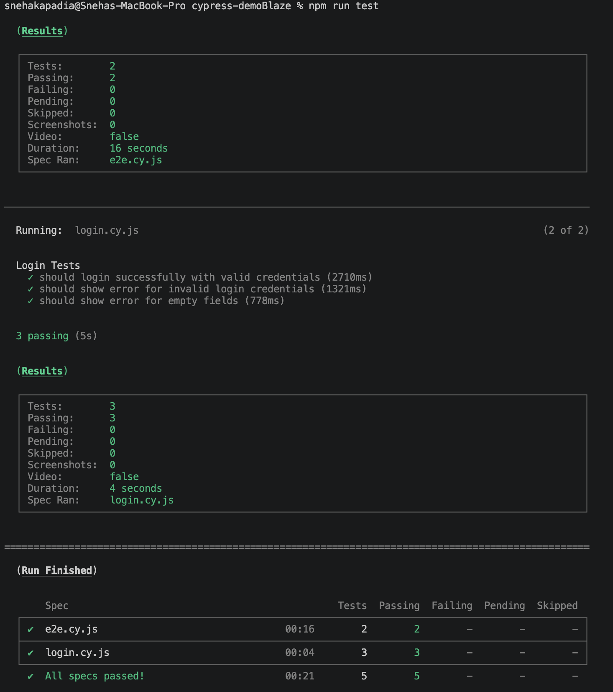
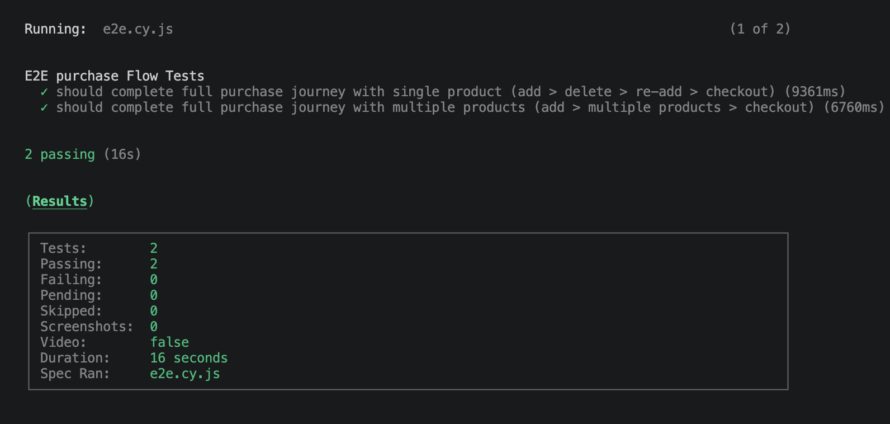
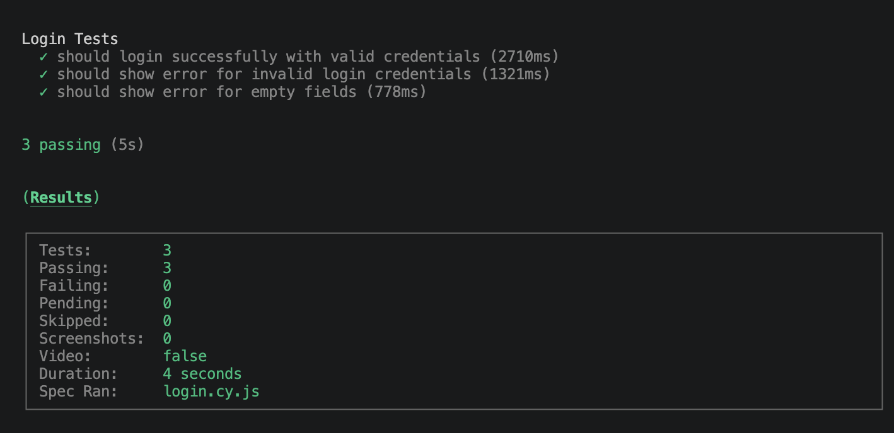
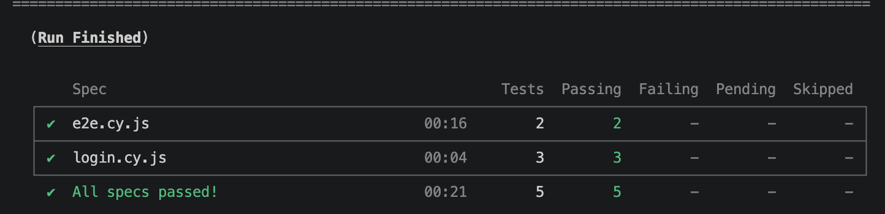

# Cypress E2E Automation – Demoblaze

This project contains automated end-to-end tests for the Demoblaze website using Cypress.

The tests cover the essential user flow of login, product selection, adding items to cart, deleting items from cart and completing a purchase.

---

## 📌 Project Setup

### Pre-requisites setup:

#### Install Node:
```bash
brew install node
```

#### Download Visual Studio:
1. Download: Go to the official VS Code website (https://code.visualstudio.com/download) and click the "Download for Mac" button (or "Mac Universal" for both Intel/Apple Silicon chips).
2. Unzip: Locate the downloaded file (usually VSCode-darwin-universal.zip) in your Downloads folder and double-click it to extract the application.
3. Install: Drag the Visual Studio Code.app file from the Downloads folder to your Applications folder.
4. Open: Open your Applications folder and double-click Visual Studio Code to launch it.
5. Security Prompt: If asked to confirm opening an app from the internet, click "Open". 


### 1. Install dependencies
```bash
npm install
```

---

## ▶️ How to run tests

### Open Cypress Test Runner (UI mode)
```bash
npm open
```

### Run tests in headless mode
```bash
npm run
```

---

## ▶️ How to view Test Result

### In the Visual Studio Terminal you can see the entire run result, below is an example:


### Sample e2e Result


### Sample login Result


### final Result


---

## 📁 Test Structure

```
cypress/
 ├── tests/
 │    ├── login.cy.js
 │    ├── e2e.cy.js
 ├── fixtures/
 │    └── users.json
 │    └── products.json
 ├── pages/
 │    ├── CartPage.js
 │    └── HomnePage.js
 │    └── LoginPage.js
 │    └── ProductPage.js
```

---

## 🧪 What is tested?

### 1. Login Tests
- Valid login with correct credentials
- Invalid login (wrong username/password)
- Empty field validation

### 2. Purchase Tests *E2E Test
- Add product to cart
- Verify product in cart
- Delete Product from cart
- Multiple products addition and checkout
- Complete purchase flow successfully

---

## 🎯 Test Approach

### ✔ What was considered essential to test and why?

The following core functionalities were prioritized:

- I have added a full e2e purchase flow from login to purchasing product. This flow is added as a basic flow as this is the important functionality for the application to go live.
- I have tried to cover some tests like Deletion of product, purchasing multiple products as I think these are essential flow for the application
- For the login page I have tried to cover some negative tests. I have not written other negative tests because of the time constraint of the assignment. Similarly we can implement the tests for other pages.

These were selected because they represent the **critical business flow of an e-commerce application**.

---

## 🏗️ Test Design Approach

- Used Cypress framework for end-to-end testing
- Implemented Page Object Model (POM) for better reusability and maintainability as I think this is easily readable.
- Used fixtures for test data separation so that we can add different set of data and data is separated from the test. Also, with this approach we can use same set of data for multiple tests.
- Used dynamic data generation for unique checkout inputs so that we dont get an issue that the same user is not used again. Here I have used Date time approach which will be unique always.
- Ensured each test is independent and repeatable so that if one of the tests fails due to being flaky then the next test wont be impacted.
- Kept seperate environment file.
- Created cypress.config.js file where default page timeout and other important test configurations are mentioned.
- Created CI/CD yml file to run test in github actions. This will execute all the tests in the suite after each merge.

## 🏗️ AI Usage

- I have used Ai for basic project setup and structure as this is one time activity and can be easily done by ai. 
- Took help to create basic structure of README file.
- Created .yml file with the help of ai.

## 🏗️ Future Enchancements

- If I would have more time to implement then according to me we should try to add the below functionalities:
    - Execute the tests in parallel 
    - Display and downloadable report in github actions
    - Reusable custom commands
    - Reporting in slack
    - Lint setup
    - More tests addition like negative, boundary, etc tests
    - Sanity tests executions
    - API tests
    - Adding Reporter

